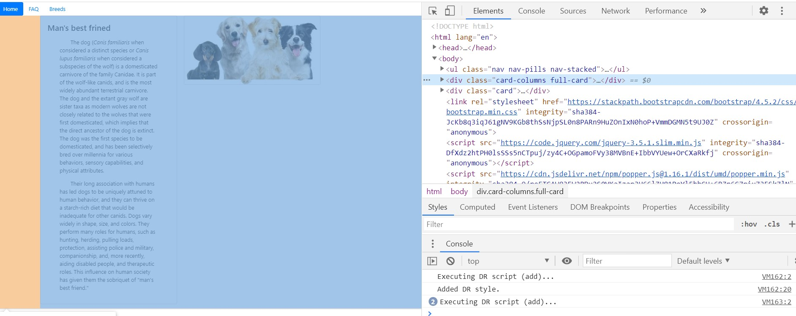

# Website all about a weird thing called a dog

## I did update my code past my video, my apologies I should have waited a few more days. Here is a photo of what I changed. This change was necessary because I overlooked the requirement of demonstrating multi-column HTML development.

